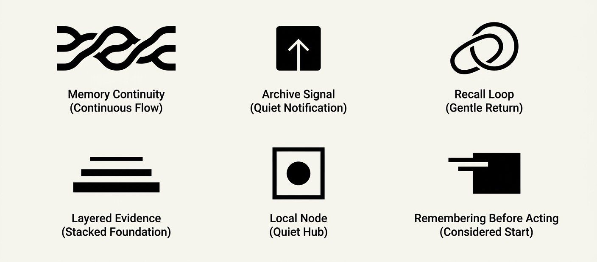

<div align="center">
  

  <p><strong>The local-first memory control plane for AI agents.</strong></p>

  <p>
    Give Codex, Claude Code, Claude Desktop, Cursor, Windsurf, VS Code, JetBrains, Ollama-backed agents,
    and custom agent services one durable memory layer they can check before they act.
  </p>

  <p>
    <a href="https://github.com/Evilander/Audrey/actions/workflows/ci.yml"></a>
    <a href="https://www.npmjs.com/package/audrey"></a>
    <a href="LICENSE"></a>
  </p>
</div>

## Why Audrey Exists

Agents forget the exact mistakes they made yesterday. They repeat broken commands, lose project-specific rules, miss contradictions, and treat every new session like a cold start.

Audrey turns those hard-won lessons into a local memory runtime:

- `memory_recall` finds durable context by semantic similarity.
- `memory_preflight` checks prior failures, risks, rules, and relevant procedures before an action.
- `memory_reflexes` converts remembered evidence into trigger-response guidance agents can follow.
- `memory_validate` closes the loop after the action — `helpful`, `used`, or `wrong` outcomes feed salience and decay.
- `memory_dream` consolidates episodes into principles and applies decay.
- `audrey impact` and `audrey doctor` tell a human or CI system whether the runtime is doing real work and is actually ready.

It is not a hosted vector database, a notes app, or a Claude-only plugin. Audrey is a SQLite-backed continuity layer that can sit under any local or sidecar agent loop.

<div align="center">
  
</div>

## Quick Start

Requires Node.js 20+.

```bash
npx audrey doctor
npx audrey demo
```

`doctor` verifies Node, the MCP entrypoint, provider selection, memory-store health, and host config generation. `demo` runs a no-key, no-host, no-network proof: it creates temporary memories, records a redacted failed tool trace, generates a Memory Capsule, proves recall, prints Memory Reflexes, and deletes the demo store.

Expected first-run shape:

```text
Audrey Doctor v0.22.2
Store health: not initialized
Verdict: ready
```

After the first real memory write, `doctor` should report the store as healthy.

## Install Into Agent Hosts

Preview host setup without editing config files:

```bash
npx audrey install --host codex --dry-run
npx audrey install --host claude-code --dry-run
npx audrey install --host generic --dry-run
```

Generate raw config blocks:

```bash
npx audrey mcp-config codex
npx audrey mcp-config generic
npx audrey mcp-config vscode
```

Claude Code can be registered directly:

```bash
npx audrey install
claude mcp list
```

All local MCP paths default to local embeddings and one shared SQLite-backed memory directory. Use `AUDREY_DATA_DIR` to isolate projects, tenants, or host identities.

Installer-generated host config does not include provider API keys by default. Prefer setting `ANTHROPIC_API_KEY`, `OPENAI_API_KEY`, `GOOGLE_API_KEY`, or `GEMINI_API_KEY` in the host runtime environment; use `npx audrey install --include-secrets` only if you explicitly accept argv/config exposure.

## Use With Ollama And Local Agents

Ollama runs models; Audrey supplies memory. Start Audrey as a local REST sidecar and expose its routes as tools in your agent loop:

```bash
AUDREY_AGENT=ollama-local-agent npx audrey serve
curl http://localhost:7437/health
curl http://localhost:7437/v1/status
```

Runnable example:

```bash
AUDREY_AGENT=ollama-local-agent npx audrey serve
OLLAMA_MODEL=qwen3 node examples/ollama-memory-agent.js "What should you remember about Audrey?"
```

Core sidecar tools:

| Agent Need | REST Route |
|---|---|
| Check memory before acting | `POST /v1/preflight` |
| Get reflex rules for an action | `POST /v1/reflexes` |
| Store a useful observation | `POST /v1/encode` |
| Recall relevant context | `POST /v1/recall` |
| Get a turn-sized memory packet | `POST /v1/capsule` |
| Check health | `GET /v1/status` |

## What Ships

| Surface | Status |
|---|---|
| MCP stdio server | 20 tools plus status/recent/principles resources and briefing/recall/reflection prompts |
| CLI | `doctor`, `demo`, `install`, `mcp-config`, `status`, `dream`, `reembed`, `observe-tool`, `promote`, `impact` |
| REST API | Hono server with `/health` and `/v1/*` routes |
| JavaScript SDK | Direct TypeScript/Node import from `audrey` |
| Python client | `pip install audrey-memory`, calls the REST sidecar |
| Storage | Local SQLite plus `sqlite-vec`, no hosted database required |
| Deployment | npm package, Docker, Compose, host-specific MCP config generation |
| Safety loop | preflight warnings, reflexes, redacted tool traces, contradiction handling |

## Memory Model

Audrey is built around the parts of memory that matter for agents:

- Episodic memory: specific observations, tool results, preferences, and session facts.
- Semantic memory: consolidated principles extracted from repeated evidence.
- Procedural memory: remembered ways to act, avoid, retry, or verify.
- Affect and salience: emotional weight and importance influence recall.
- Interference and decay: stale, conflicting, or low-confidence memories lose authority over time.
- Contradiction handling: competing claims are tracked instead of silently overwritten.
- Tool-trace learning: failed commands and risky actions become future preflight warnings.

The product bet is simple: the next generation of useful agents will not just retrieve facts. They will remember what happened, decide whether a memory is still trustworthy, and use that memory before touching tools.

## Use Audrey From Code

### JavaScript

```js
import { Audrey } from 'audrey';

const brain = new Audrey({
  dataDir: './audrey-data',
  agent: 'support-agent',
  embedding: { provider: 'local', dimensions: 384 },
});

await brain.encode({
  content: 'Stripe returns HTTP 429 above 100 req/s',
  source: 'direct-observation',
  tags: ['stripe', 'rate-limit'],
});

const memories = await brain.recall('stripe rate limit');

await brain.waitForIdle();
brain.close();
```

### Python

```bash
pip install audrey-memory
```

```python
from audrey_memory import Audrey

brain = Audrey(base_url="http://127.0.0.1:7437", agent="support-agent")
memory_id = brain.encode("Stripe returns HTTP 429 above 100 req/s", source="direct-observation")
results = brain.recall("stripe rate limit", limit=5)
brain.close()
```

## Production Readiness

Audrey is close to a 1.0-ready local memory runtime, but production depends on how it is embedded. Treat it like stateful infrastructure.

Release gates used for this package:

```bash
npm run release:gate
npx audrey doctor
npx audrey demo
```

Recommended runtime checks:

```bash
npx audrey doctor --json
npx audrey status --json --fail-on-unhealthy
npx audrey install --host codex --dry-run
```

Production controls you still own:

- Set one `AUDREY_DATA_DIR` per tenant, environment, or isolation boundary.
- Pin `AUDREY_EMBEDDING_PROVIDER` and `AUDREY_LLM_PROVIDER` explicitly.
- Back up the SQLite data directory before provider or dimension changes.
- Keep API keys and raw credentials out of encoded memory content.
- Use `AUDREY_API_KEY` if the REST sidecar is reachable beyond the local process boundary.
- Run `npx audrey dream` on a schedule so consolidation and decay stay current.
- Add application-level encryption, retention, access control, and audit logging for regulated environments.

## Environment Variables

| Variable | Default | Purpose |
|---|---|---|
| `AUDREY_DATA_DIR` | `~/.audrey/data` | SQLite memory store path. Use one per tenant or agent identity for isolation. |
| `AUDREY_AGENT` | `local-agent` | Logical agent identity stamped on writes. |
| `AUDREY_EMBEDDING_PROVIDER` | `local` | `local`, `gemini`, `openai`, or `mock`. Cloud providers require explicit opt-in. |
| `AUDREY_LLM_PROVIDER` | auto | `anthropic`, `openai`, or `mock`. |
| `AUDREY_DEVICE` | `gpu` | Local embedding device (`gpu` or `cpu`). Falls back to CPU if GPU init fails. |
| `AUDREY_PORT` | `7437` | REST sidecar port. |
| `AUDREY_HOST` | `127.0.0.1` | REST sidecar bind address. Set to `0.0.0.0` only with `AUDREY_API_KEY`. |
| `AUDREY_API_KEY` | unset | Bearer token required for non-loopback REST traffic. |
| `AUDREY_ALLOW_NO_AUTH` | `0` | Set to `1` to allow non-loopback bind without an API key. Don't. |
| `AUDREY_ENABLE_ADMIN_TOOLS` | `0` | Set to `1` to enable export, import, and forget routes/tools. Disabled by default. |
| `AUDREY_PROMOTE_ROOTS` | unset | Colon/semicolon-separated extra roots for `audrey promote --yes` writes. By default writes are restricted to `process.cwd()`. |
| `AUDREY_DEBUG` | `0` | Set to `1` to print MCP info logs (server started, warmup completed). Errors always log. |
| `AUDREY_PROFILE` | `0` | Set to `1` to emit per-stage timings via MCP `_meta.diagnostics`. |
| `AUDREY_DISABLE_WARMUP` | `0` | Set to `1` to skip background embedding warmup at MCP boot. |
| `AUDREY_ONNX_VERBOSE` | `0` | Set to `1` to restore ONNX runtime EP-assignment warnings (suppressed by default). |
| `AUDREY_PRAGMA_DEFAULTS` | `1` | Set to `0` to revert SQLite PRAGMA tuning to better-sqlite3 defaults. |
| `AUDREY_CONTEXT_BUDGET_CHARS` | `4000` | Default Memory Capsule character budget. |

## Benchmarks

Audrey ships two benchmark commands.

### Performance snapshot

`npm run bench:perf-snapshot` measures encode and hybrid recall latency at multiple corpus sizes against the in-process mock provider. It reports p50/p95/p99 plus machine provenance so the numbers are reproducible and honest about what they cover.

```bash
npm run build
npm run bench:perf-snapshot                                 # default sizes 100, 1000, 5000
node benchmarks/perf-snapshot.js --sizes 1000,10000 --json  # custom shape
```

Sample output from `benchmarks/snapshots/perf-0.22.2.json` (24-core Ryzen 9 7900X3D, Node 25.5.0, mock 64-dim embedding, hybrid recall, limit 5):

| Corpus size | Encode p50 (ms) | Encode p95 (ms) | Recall p50 (ms) | Recall p95 (ms) | Recall p99 (ms) |
|---|---|---|---|---|---|
| 100 | 0.33 | 0.63 | 0.52 | 1.3 | 3.1 |
| 1,000 | 0.31 | 1.3 | 0.63 | 0.99 | 7.0 |
| 5,000 | 0.29 | 1.7 | 2.1 | 2.5 | 18.0 |

These numbers cover Audrey's own pipeline (SQLite + sqlite-vec + hybrid ranking) and exclude embedding-provider cost. Real-world recall p95 with a local 384-dim provider is typically 5–15× higher; with a hosted provider it is dominated by the API round-trip. Run on your own hardware before quoting numbers anywhere.

### Behavioral regression suite

`npm run bench:memory:check` is a release gate. It runs a small set of retrieval and lifecycle scenarios (information extraction, knowledge updates, multi-session reasoning, conflict resolution, privacy boundary, overwrite, delete-and-abstain, semantic/procedural merge) against Audrey and three weak baselines (vector-only, keyword+recency, recent-window) and asserts Audrey doesn't regress. The baseline comparisons exist to catch correctness regressions in retrieval logic, not to make marketing claims.

```bash
npm run bench:memory          # full regression suite (writes JSON + report)
npm run bench:memory:check    # release gate, exits non-zero on regression
```

## Command Reference

```bash
# First contact
npx audrey doctor
npx audrey demo

# MCP setup
npx audrey install --host codex --dry-run
npx audrey mcp-config codex
npx audrey mcp-config generic
npx audrey install
npx audrey uninstall

# Health and maintenance
npx audrey status
npx audrey status --json --fail-on-unhealthy
npx audrey dream
npx audrey reembed

# Closed-loop visibility
npx audrey impact
npx audrey impact --json --window 7 --limit 5

# Tool-trace learning
npx audrey observe-tool --event PostToolUse --tool Bash --outcome failed
npx audrey promote --dry-run

# REST sidecar
npx audrey serve
docker compose up -d --build
```

The Node sidecar defaults to `127.0.0.1:7437`. The Docker image intentionally binds inside the container on `3487`; override the published host port with `AUDREY_PUBLISHED_PORT` when using Compose.

## Documentation

- [Security policy](SECURITY.md)
- Public setup, runtime, benchmark, and command guidance is maintained in this README.

## Development

```bash
npm ci
npm run release:gate
python -m unittest discover -s python/tests -v
python -m build --no-isolation python
```

On some locked-down Windows hosts, Vitest/Vite can fail before tests start with `spawn EPERM`. That is an environment process-spawn blocker, not an Audrey runtime failure. Use `npm run release:gate:sandbox`, direct `dist/` smokes, and GitHub Actions as the release evidence path.

## License

MIT. See [LICENSE](LICENSE).
