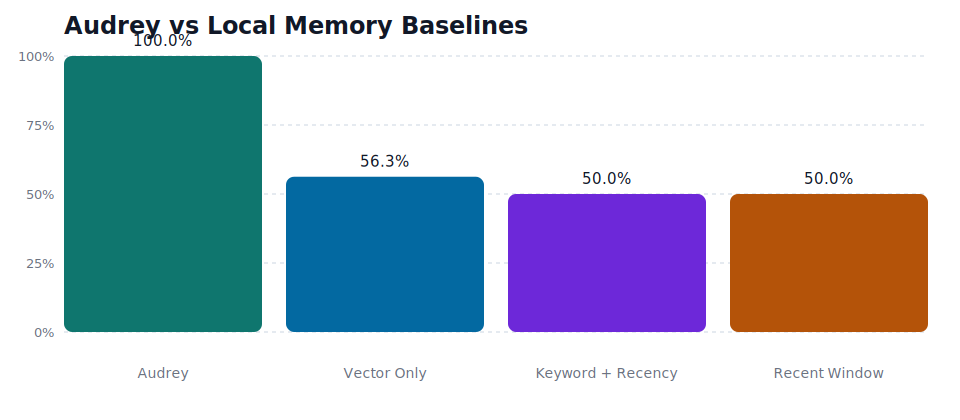
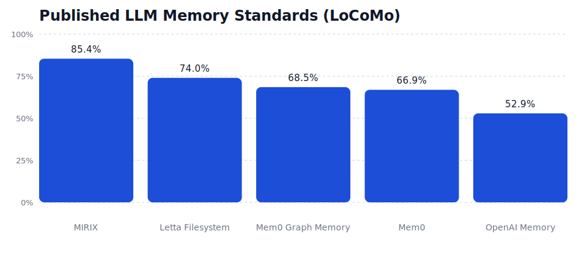

# Audrey

[](https://github.com/Evilander/Audrey/actions/workflows/ci.yml)
[](https://www.npmjs.com/package/audrey)
[](LICENSE)

Persistent memory for Claude Code and AI agents. Two commands, every session remembers.

```bash
npx audrey install          # 13 MCP memory tools
npx audrey hooks install    # automatic memory in every session
```

That's it. Claude Code now wakes up knowing what happened yesterday, recalls relevant context per-prompt, and consolidates learnings when the session ends. No cloud, no config files, no infrastructure — one SQLite file.

Audrey also works as a standalone SDK, MCP server, and REST API for any AI agent framework.

> **On `/dream`** — Anthropic recently shipped `/dream` for Claude Code memory maintenance. Audrey predates it and goes further: episodic-to-semantic consolidation, contradiction detection, confidence decay, emotional affect, causal reasoning, and source reliability weighting. `/dream` is a maintenance pass. Audrey is a cognitive memory architecture.

## Why Audrey

Most AI memory tools are storage wrappers. They save facts, retrieve facts, and keep everything forever. That leaves real production problems unsolved:

- Old information stays weighted like new information.
- Raw events never become reusable operating knowledge.
- Conflicting facts quietly coexist.
- Model-generated mistakes can get reinforced into false "truth."

Audrey models memory as a working system instead of a filing cabinet.

| Brain Structure | Audrey Component | What It Does |
|---|---|---|
| Hippocampus | Episodic Memory | Fast capture of raw events and observations |
| Neocortex | Semantic Memory | Consolidated principles and patterns |
| Cerebellum | Procedural Memory | Learned workflows and conditional behaviors |
| Sleep Replay | Dream Cycle | Consolidates episodes into principles and applies decay |
| Prefrontal Cortex | Validation Engine | Truth-checking and contradiction detection |
| Amygdala | Affect System | Emotional encoding, arousal-salience coupling, and mood-congruent recall |

## What You Get

- Local SQLite-backed memory with `sqlite-vec`
- MCP server for Claude Code with 13 memory tools
- **Claude Code hooks integration** — automatic memory in every session (`npx audrey hooks install`)
- JavaScript SDK for direct application use
- **Git-friendly versioning** via JSON snapshots (`npx audrey snapshot` / `restore`)
- **REST API server** — any language, any framework (`npx audrey serve`)
- Health checks via `npx audrey status --json`
- Benchmark harness with SVG/HTML reports via `npm run bench:memory`
- Regression gate for benchmark quality via `npm run bench:memory:check`
- Optional local embeddings and optional hosted LLM providers
- Strongest production fit today in financial services ops and healthcare ops

## Install

### MCP Server for Claude Code

```bash
npx audrey install          # Register 13 MCP memory tools
npx audrey hooks install    # Wire automatic memory into session lifecycle
```

Audrey auto-detects providers from your environment:

- `GOOGLE_API_KEY` or `GEMINI_API_KEY` -> Gemini embeddings (3072d)
- no embedding key -> local embeddings (384d, MiniLM, offline-capable)
- `AUDREY_EMBEDDING_PROVIDER=openai` -> explicit OpenAI embeddings (1536d)
- `ANTHROPIC_API_KEY` -> LLM-powered consolidation, contradiction detection, and reflection

Quick checks:

```bash
npx audrey status
npx audrey status --json
npx audrey status --json --fail-on-unhealthy
```

### SDK

```bash
npm install audrey
```

Zero external infrastructure. One SQLite file.

## Quick Start

```js
import { Audrey } from 'audrey';

const brain = new Audrey({
  dataDir: './agent-memory',
  agent: 'support-agent',
  embedding: { provider: 'local', dimensions: 384 },
});

await brain.encode({
  content: 'Stripe API returned 429 above 100 req/s',
  source: 'direct-observation',
  tags: ['stripe', 'rate-limit'],
  context: { task: 'debugging', domain: 'payments' },
  affect: { valence: -0.4, arousal: 0.7, label: 'frustration' },
});

const memories = await brain.recall('stripe rate limits', {
  limit: 5,
  context: { task: 'debugging', domain: 'payments' },
});

const dream = await brain.dream();
const briefing = await brain.greeting({ context: 'debugging stripe' });

brain.close();
```

## MCP Tools

Every Claude Code session gets these tools after `npx audrey install`:

- `memory_encode`
- `memory_recall`
- `memory_consolidate`
- `memory_dream`
- `memory_introspect`
- `memory_resolve_truth`
- `memory_export`
- `memory_import`
- `memory_forget`
- `memory_decay`
- `memory_status`
- `memory_reflect`
- `memory_greeting`

## CLI

```bash
# Setup
npx audrey install              # Register MCP server with Claude Code
npx audrey uninstall            # Remove MCP server registration
npx audrey hooks install        # Wire Audrey into Claude Code hooks (automatic memory)
npx audrey hooks uninstall      # Remove Audrey hooks

# Health and monitoring
npx audrey status               # Human-readable health report
npx audrey status --json        # Machine-readable health output
npx audrey status --json --fail-on-unhealthy  # CI gate

# Session lifecycle (used by hooks automatically)
npx audrey greeting             # Load identity, principles, mood
npx audrey greeting "auth"      # With context-aware recall
npx audrey recall "query"       # Semantic memory search (returns hook-compatible JSON)
npx audrey reflect              # Consolidate learnings from stdin conversation + dream

# Maintenance
npx audrey dream                # Full consolidation + decay cycle
npx audrey reembed              # Re-embed all memories after provider/dimension change

# Versioning
npx audrey snapshot             # Export memories to timestamped JSON file
npx audrey snapshot backup.json # Export to specific file
npx audrey restore backup.json  # Restore from snapshot (re-embeds with current provider)
npx audrey restore backup.json --force  # Overwrite existing memories

# REST API server
npx audrey serve                # Start HTTP server on port 3487
npx audrey serve 8080           # Custom port
```

## Hooks Integration

Audrey integrates directly into Claude Code's hook lifecycle for automatic, zero-config memory in every session:

```bash
npx audrey hooks install
```

This configures four hooks in `~/.claude/settings.json`:

| Hook Event | Command | What Happens |
|---|---|---|
| **SessionStart** | `npx audrey greeting` | Loads identity, learned principles, current mood, and recent memories |
| **UserPromptSubmit** | `npx audrey recall` | Semantic search on every prompt — injects relevant memories as context |
| **Stop** | `npx audrey reflect` | Extracts lasting learnings from the conversation, then runs a dream cycle |
| **PostCompact** | `npx audrey greeting` | Re-injects critical memories after context window compaction |

With hooks installed, Claude Code sessions automatically wake up with context, recall relevant memories per-prompt, and consolidate learnings when the session ends. No manual tool calls needed.

## REST API Server

Turn Audrey into an HTTP service that any language or framework can use:

```bash
npx audrey serve           # Start on port 3487
npx audrey serve 8080      # Custom port
AUDREY_API_KEY=secret npx audrey serve  # With Bearer token auth
```

Endpoints:

| Method | Path | Description |
|--------|------|-------------|
| `GET` | `/health` | Liveness probe |
| `GET` | `/status` | Memory stats (introspect) |
| `POST` | `/encode` | Store a memory (`{ content, source, tags?, context?, affect? }`) |
| `POST` | `/recall` | Semantic search (`{ query, limit?, context? }`) |
| `POST` | `/dream` | Full consolidation + decay cycle |
| `POST` | `/consolidate` | Run consolidation only |
| `POST` | `/forget` | Forget by `{ id }` or `{ query }` |
| `POST` | `/snapshot` | Export all memories as JSON |
| `POST` | `/restore` | Wipe and reimport from snapshot |

Example from any language:

```bash
# Store a memory
curl -X POST http://localhost:3487/encode \
  -H "Content-Type: application/json" \
  -d '{"content": "The deploy failed due to OOM", "source": "direct-observation"}'

# Search memories
curl -X POST http://localhost:3487/recall \
  -H "Content-Type: application/json" \
  -d '{"query": "deploy failures", "limit": 5}'
```

## Versioning

Audrey stores memories in SQLite with WAL mode, which isn't git-friendly. Instead, use JSON snapshots:

```bash
# Save a checkpoint
npx audrey snapshot

# Commit it
git add audrey-snapshot-*.json && git commit -m "memory checkpoint"

# Restore on another machine or after a reset
npx audrey restore audrey-snapshot-2026-03-24_15-30-00.json
```

Snapshots are human-readable, diffable, and provider-agnostic. Embeddings are re-generated on import, so you can switch providers (e.g., local to Gemini) and restore seamlessly.

## Production Fit

Audrey is strongest today in workflows where memory must stay local, reviewable, and durable:

- **Financial services operations**: payments ops, fraud and dispute workflows, KYC/KYB review, internal policy assistants
- **Healthcare operations**: care coordination, prior-auth workflows, intake and referral routing, internal staff knowledge assistants

Audrey is a memory layer, not a compliance boundary. For regulated environments, pair it with application-level access control, encryption, retention, audit logging, and data-minimization rules.

Production guide: [docs/production-readiness.md](docs/production-readiness.md)

Industry demos:

- [examples/fintech-ops-demo.js](examples/fintech-ops-demo.js)
- [examples/healthcare-ops-demo.js](examples/healthcare-ops-demo.js)

## Core Concepts

### Memory Types

- **Episodic**: raw events and observations
- **Semantic**: consolidated principles
- **Procedural**: reusable workflows and actions
- **Causal**: relationships that explain why something happened

### Confidence

Audrey scores memories using source reliability, evidence agreement, recency decay, and retrieval reinforcement. That helps keep direct observations above guesses and keeps stale or weakly supported knowledge from dominating recall.

### Dream Cycle

`brain.dream()` runs the full maintenance path:

1. Consolidate related episodes into principles.
2. Apply decay so low-value memories lose weight over time.
3. Report memory health and current stats.

### Contradiction Handling

When evidence conflicts, Audrey tracks the contradiction instead of silently picking a winner. Resolutions can stay open, be marked resolved, or become context-dependent.

## Configuration

```js
const brain = new Audrey({
  dataDir: './audrey-data',
  agent: 'my-agent',
  embedding: {
    provider: 'local', // mock | local | gemini | openai
    dimensions: 384,
    device: 'gpu',
  },
  llm: {
    provider: 'anthropic', // mock | anthropic | openai
    apiKey: process.env.ANTHROPIC_API_KEY,
  },
  consolidation: {
    minEpisodes: 3,
  },
  context: {
    enabled: true,
    weight: 0.3,
  },
  affect: {
    enabled: true,
    weight: 0.2,
  },
  decay: {
    dormantThreshold: 0.1,
  },
});
```

## Operations

Recommended production workflow:

```bash
# Health checks
npx audrey status
npx audrey status --json --fail-on-unhealthy

# Scheduled maintenance
npx audrey dream

# Repair vector/index drift after provider or dimension changes
npx audrey reembed

# Version control your memories
npx audrey snapshot
npx audrey restore <file> --force

# Run the benchmark harness
npm run bench:memory

# Fail CI if Audrey drops below benchmark guardrails
npm run bench:memory:check
```

## Benchmarking

Audrey now ships with a memory benchmark harness built for two purposes:

- measure Audrey against naive local baselines on LongMemEval-style memory abilities plus privacy and abstention checks
- keep Audrey grounded against published LoCoMo results from leading memory systems

Run it with:

```bash
npm run bench:memory
```

Artifacts land in `benchmarks/output/` as JSON, SVG charts, and an HTML report.

For CI and release gates:

```bash
npm run bench:memory:check
```

That command fails if Audrey drops below its minimum local score, local pass rate, or required margin over the strongest naive baseline.

For committed GitHub-friendly charts:

```bash
npm run bench:memory:readme-assets
```

### README Snapshot

Local Audrey-vs-baseline results:



Published comparison anchors from current LLM memory systems:



**Important:** These are two different measurement contexts. Audrey's bar is from its internal LongMemEval-style suite using mock embeddings. The external bars are published LoCoMo scores from primary sources — different benchmark, different conditions. They are included as field context, not a direct comparison. Running Audrey against LoCoMo proper is on the roadmap.

| System | Anchor | What it represents |
|---|---|---|
| Audrey | Internal LongMemEval-style suite | Local-first memory with consolidation, contradiction handling, abstention, and privacy checks |
| MIRIX | Published LoCoMo 85.4 | Typed multimodal memory with strong temporal/state handling |
| Letta Filesystem | Published LoCoMo 74.0 | Context-engineering and filesystem-style memory |
| Mem0 Graph Memory | Published LoCoMo 68.5 | Graph memory with production cost/latency focus |
| Mem0 | Published LoCoMo 66.9 | Production-oriented long-term memory baseline |
| LongMemEval | Benchmark protocol | Benchmark focused on extraction, updates, temporal reasoning, multi-session reasoning, and abstention |

Primary comparison sources:

- [MIRIX paper](https://arxiv.org/abs/2507.07957)
- [Mem0 paper](https://arxiv.org/abs/2504.19413)
- [Letta benchmark write-up](https://www.letta.com/blog/benchmarking-ai-agent-memory)
- [LongMemEval paper](https://arxiv.org/abs/2410.10813)

Benchmark guide: [docs/benchmarking.md](docs/benchmarking.md)

## Repository

- Contributing guide: [CONTRIBUTING.md](CONTRIBUTING.md)
- Security policy: [SECURITY.md](SECURITY.md)
- CI workflow: [.github/workflows/ci.yml](.github/workflows/ci.yml)
- Benchmarking guide: [docs/benchmarking.md](docs/benchmarking.md)

## Development

```bash
npm ci
npm test
npm run pack:check
npm run bench:memory
npm run bench:memory:check
npm run bench:memory:readme-assets
```

Current validated baseline:

- `npm test`
- `npm run pack:check`
- `npm run bench:memory`
- `npm run bench:memory:check`
- `npm run bench:memory:readme-assets`

## License

MIT. See [LICENSE](LICENSE).
