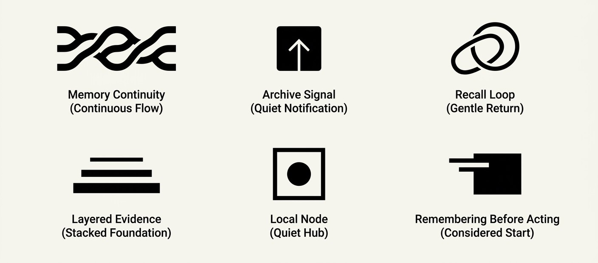

<div align="center">
  

  <p><strong>Memory that shows up before your coding agent makes the same mistake twice.</strong></p>

  <p>
    Audrey gives Codex and Claude Code one local, evidence-backed memory loop:
    remember what mattered, recall it automatically, check before acting, and learn from what happened next.
  </p>

  <p>
    <a href="https://github.com/Evilander/Audrey/actions/workflows/ci.yml"></a>
    <a href="https://www.npmjs.com/package/audrey"></a>
    <a href="LICENSE"></a>
  </p>
</div>

## Your agent should remember the work, not just the chat

You fix the deploy command on Monday. On Thursday, a fresh session tries the broken version again.

You explain that this repository never commits generated files. The next agent helpfully commits them.

You discover a subtle migration rule, write it down somewhere, and still have to remember to paste it into every new conversation.

That is the gap Audrey closes.

Audrey sits beside the agent and participates in the work automatically. At the start of a session it brings back a small, relevant memory packet. When you submit a prompt, it recalls project facts, preferences, procedures, and recent risks. Before a side-effectful tool runs, Audrey checks the proposed action against prior evidence. Afterward, it links the outcome back to the exact check that preceded it.

The model does not have to remember that a memory tool exists. That is the point.

## Meet Audrey Autopilot

Install Audrey once, review the hooks once, and then use Codex or Claude Code normally.

```bash
npm install -g audrey --allow-scripts=better-sqlite3,onnxruntime-node,sharp,protobufjs
audrey install --host auto
```

The explicit install-script list is for npm 12's safer dependency policy. It permits only the four packages Audrey needs for SQLite, local inference, and their generated runtime files. With npm 11 or earlier, the shorter `npm install -g audrey` is equivalent.

`auto` configures whichever supported CLIs are installed. You can choose one explicitly:

```bash
audrey install --host codex
audrey install --host claude-code
```

Restart the host after installation. Codex asks you to trust non-managed hooks once through `/hooks`; Claude Code may also ask you to approve project or plugin components. Audrey is automatic after that explicit install-and-trust step—never secretly installed.

Autopilot then closes the loop:

| Moment | What Audrey does |
|---|---|
| Session starts | Injects a compact, agent-scoped memory briefing |
| You send a prompt | Recalls relevant evidence; explicitly durable phrases such as “remember that…” or “I prefer…” can become memories |
| Bash/edit/write is proposed | Checks exact prior failures, trusted rules, procedures, contradictions, and memory health |
| The tool finishes | Correlates `tool_use_id` to the Guard receipt and records the redacted outcome |
| A tool failure is reported | Forms a durable, sanitized failure memory for the next attempt |
| The turn stops or context compacts | Runs lightweight, due-only consolidation without holding the conversation open |

Each hook event carries a host-declared timeout (30 seconds for the `PreToolUse` Guard check); Audrey races its own internal embedding/LLM timeout a few seconds ahead of that deadline so it can exit cleanly instead of losing the race to the host's kill. Infrastructure failures are fail-open by default: if Audrey itself errors or runs out of time, the tool call proceeds unguarded rather than freezing the session. Set `AUDREY_HOOK_FAIL_CLOSED=1` to deny the action instead when the `PreToolUse` check fails this way; other lifecycle hooks (session start, prompt recall, post-tool bookkeeping) have no "deny" to fall back to and always degrade open regardless of this setting.

## A small story about a failed deploy

The first attempt fails:

```text
$ npm run deploy
Error: deployment target is missing
```

Audrey keeps a redacted trace and the exact action fingerprint. If another session proposes the same action before the problem is fixed, Guard returns a denial with evidence. Change the command or fix the target and Audrey lets the work continue. Once that exact action succeeds, the old failure no longer blocks it.

This is more useful than “the vector search found a vaguely similar error.” Audrey creates a receipt before the action, records what happened after it, and preserves the lineage between the two.

Try the complete loop without an API key or network call:

```bash
audrey demo --scenario repeated-failure
```

## Looking is not doing

Between the failed deploy and the retry, an agent runs a lot of commands that cannot change anything: `grep` for the error, `git status`, `cat` on a config file, `ls` on a directory that turns out not to exist. A memory system that treats every one of those as a risk, or remembers `grep` finding nothing as a "failure", becomes a smoke alarm that goes off when you make toast. People stop listening, and then it is worth nothing on the day the toaster is on fire.

Audrey reads the command the way an engineer would. A command whose every part is positively recognised as read-only (`grep`, `git log`, `npm view`, `docker ps`, `sed -n '1,40p'`, and their kind, with no command substitution, no redirect except to `/dev/null`, no `sudo` or `xargs`, no environment assignment that could change what the verb resolves to) never reaches the Guard at all. Its exit code is recorded but never counted as a lesson. Everything else is guarded exactly as before, and anything Audrey cannot positively recognise is treated as doing.

```text
$ grep -rn "prisma" src/          Guard: silent
$ git status --short              Guard: silent
$ cat prisma/schema.prisma        Guard: silent
$ npm run deploy
Audrey Guard: BLOCKED
- recent_failure (high): This exact Bash action failed before: Prisma client was not generated. Run npm run db:generate before deploy.
- must_follow (high): Before running npm run deploy, run npm run db:generate because Prisma client must be generated first.
```

That is the output of `audrey demo --scenario repeated-failure`, which runs the whole sequence with no API key and no network.

When Guard does speak, it names the memory it is speaking from, and a remembered failure is matched to the proposed command by what it runs (`npm run deploy` against `npm run deploy`), not by how similar two strings look to an embedding.

The line between looking and doing is drawn fail-closed and was tested adversarially before release: three independent review passes ran the classifier's "read-only" verdicts against real tools and found eleven ways to hide a write inside a command that looked harmless (`node --check -r ./x.js`, `GIT_EXTERNAL_DIFF=./x git diff`, `sort -ofile`, a backslash-newline hiding `$(`). Every one is closed and is a test case. Two limits remain by design: a git configuration that already names an external program runs on any read, and a file whose name is a flag can change what a pure reader does with a glob. Both require a prior write that Guard did see.

## What Audrey remembers

Audrey treats memory as more than a pile of text chunks.

- Episodes are things that happened: a user decision, a tool result, a project fact, a preference.
- Semantic memories are principles supported by accumulated evidence.
- Procedural memories are ways of acting: how to retry, verify, avoid, or recover.
- Contradictions stay visible instead of being silently overwritten.
- Confidence changes with source quality, evidence, age, retrieval, interference, context, and feedback.
- Low-value memories decay; repeated evidence can consolidate into longer-lived knowledge.

Every context packet includes memory IDs, confidence, provenance where available, and a reason for inclusion. Uncertain or disputed memories are labeled as such. Retrieved content is wrapped with a simple rule: memory is evidence, not authority; current system and user instructions always win.

## When a memory stops being true

Age is not the only way a memory goes wrong. A note saying "ship with `npm run deploy:prod`" is perfectly recent, well sourced, and completely wrong the day that script is deleted. Worse, every recall reinforces it, because retrieval counts as evidence that a memory is useful. A confidently stated, well-supported, false instruction is more damaging than no memory at all.

So Audrey checks. When a memory is written, it records the claims inside it that can be verified against the project — repository-relative paths and package script names — and keeps only the ones that resolve at that moment. That last part is what makes the signal worth anything: a claim that never resolved is a guess about a typo, while a claim that resolved once and no longer does is the world moving out from under a memory that still asserts it.

```bash
audrey ground
```

```text
[audrey] Grounding memories against /home/you/project
[audrey] Checked 14: 12 still true, 2 broken, 0 repaired.
[audrey]   01K8ZQ... references a missing npm_script: deploy:prod
[audrey]   01K8ZR... references a missing path: scripts/release.mjs
```

Broken memories are not deleted. They keep their content, say plainly what they still refer to, and take a confidence penalty so they stop leading by default while remaining readable and repairable. They also stop being eligible for the packet's must-follow section — that is the section that can force a Guard block, and a rule naming a file that no longer exists is a rule nobody can follow.

Repair is symmetric. Restore the file or the script and the next check clears the flag. A checkout that has moved reports unknown rather than broken, because a memory should not be discredited for describing a project this machine cannot currently see.

Memories with no checkable claims are left unlabeled. Silence is not a clean bill of health, and presenting it as one would be the same mistake pointed the other way.

## Everything it does, and when you'd actually use it

Most of this runs on its own once Autopilot is installed. You do not invoke recall, and you do not invoke Guard. The table is here for the parts you would reach for deliberately, and so the automatic parts are legible rather than magic.

| What | When you want it | Why it helps | How |
|---|---|---|---|
| **Autopilot** | Always, after one install | The whole point. Memory arrives before the agent acts instead of after you notice it went wrong. | `audrey install --host auto`, restart the host, approve hooks once |
| **Guard** | Automatic, before any edit, write, or shell command that can have side effects | Checks the exact action fingerprint against prior failures. Not "something like this broke once" — this exact command, still broken. Read-only commands (`grep`, `ls`, `git status`) are not guarded, and their non-zero exits are not remembered as failures. | Runs at `PreToolUse`. Manually: `audrey guard --tool Bash --strict` |
| **Grounding** | After deleting or renaming things a memory might mention | Confidence tells you a memory is well-sourced. Grounding tells you it is still true. A note about a script you deleted is confident and wrong. | `audrey ground`, or let the maintenance sweep do it |
| **Session briefing** | Automatic at session start | Small, scoped packet instead of pasting context every time. Each memory injects once per session, not every prompt. | `SessionStart` hook. Preview with `audrey greeting` |
| **Explicit capture** | When you say "remember that…" or "I prefer…" | Deliberate memories are worth more than inferred ones, and phrasing it that way is enough. | Just type it. Autopilot picks up those sentence shapes |
| **Consolidation** | Automatic when idle; manually before a long break | Repeated episodes become one principle. Otherwise the store is a pile of near-duplicates and recall gets noisy. | `audrey dream` |
| **Contradictions** | When two memories disagree | Neither one silently wins. Both stay visible and labeled until something resolves them. | Surfaced in packets; `memory_resolve_truth` to settle one |
| **Decay** | Automatic | Low-value memories fade. Reinforced ones stick around. Runs in the same sweep as consolidation. | Part of `audrey dream` |
| **Promote** | When a pattern deserves to be a repo rule | Moves a learned habit out of memory and into a file your team can read and review. | `audrey promote --dry-run` first |
| **Impact** | When you want to know whether any of this is working | Shows which memories were used and whether they helped. Answers "is this earning its keep". | `audrey impact --window 30` |
| **Snapshot** | Backups, or moving to a new machine | Full store in one JSON file. Import treats it as untrusted: redacted and stripped of trust markers on the way in. | `AUDREY_ENABLE_ADMIN_TOOLS=1`, then `memory_export` / `memory_import` |
| **Doctor** | Packets stopped arriving | The two real causes are a drifted hook entrypoint and starved consolidation. Doctor names which one. | `audrey doctor` |
| **Demo** | Before trusting any of this | Runs the whole loop with no API key and no network. Nothing to configure to see it work. | `audrey demo --scenario repeated-failure` |
| **REST sidecar** | Custom agents that are not Codex or Claude Code | Same memory runtime, same evidence contract, over HTTP. Python and JS clients included. | `audrey serve` with `AUDREY_API_KEY` set |

## What Audrey deliberately does not do

Audrey does not upload your memory to a hosted service by default. It does not treat every sentence as permanent truth. It does not promote instructions from arbitrary tool output into trusted policy. It does not claim that a small local benchmark proves state-of-the-art memory quality.

Raw prompt events and tool bodies are not retained by default. Audrey stores hashes, bounded summaries, fingerprints, and redaction metadata. Explicit user-memory language is persisted intentionally; tool failure memories are sanitized first. Admin export/import/forget/promote surfaces are disabled unless `AUDREY_ENABLE_ADMIN_TOOLS=1`.

At-rest encryption, identity-bound tenant authorization, rate limiting, and regulated retention remain deployment responsibilities today. They are not hidden behind a “production ready” badge.

## Why a team might actually want this

### Fewer repeated mistakes

Guard checks memory at the point where it can change an action, not after the damage is done. Exact failure fingerprints avoid the noisy “one Bash command failed, so all Bash commands are suspicious” behavior.

### Continuity across agent sessions

Audrey is not tied to one model vendor. Codex and Claude Code use the same memory runtime and the same evidence contract. MCP, REST, JavaScript, and Python clients make the core usable in custom agents too.

### Evidence a human can inspect

Allow, warn, and block decisions carry receipts and evidence IDs. Outcome records connect back to those receipts. Teams can ask not only “what did the agent remember?” but “which memory changed this action, and was that useful?”

### Local control

The default store is SQLite, FTS5, and `sqlite-vec`. Local embeddings are the default. Cloud embedding or LLM providers require explicit configuration.

### A safer shared store

Agent-scoped recall now continues through validation, contradiction detection, interference, affect, failure lookup, capsules, greetings, Guard, and REST request routing. Hidden retrieval candidates do not reinforce themselves; only memories actually surfaced to the caller receive retrieval bookkeeping (usage count and last-reinforced timestamp for semantic and procedural memories). Explicit validation feedback (`memory_validate` / `/v1/validate`) separately adjusts salience based on how a memory actually performed, not merely on being recalled.

Vector candidates are partitioned by agent before nearest-neighbor ranking, so one busy agent cannot crowd another out of a bounded search. For hard tenant boundaries, still use a distinct `AUDREY_DATA_DIR` per tenant or security domain.

## See it before installing anything

```bash
npm exec --yes --package=audrey --allow-scripts=better-sqlite3,onnxruntime-node,sharp,protobufjs -- audrey demo --scenario repeated-failure
```

That command runs from the npm cache, exercises the full SQLite-backed Guard loop, and leaves host configuration unchanged.

<div align="center">
  
</div>

## Where we want to take it

The ambition is a temporal evidence graph for agents: immutable observations, explicit validity windows, source trust, evolving claims, scoped procedures, and outcome-calibrated policy. The defensible part is not storing more text. It is knowing what was believed, why, in which context, for how long, and whether acting on it helped.

Near-term work includes durable background cognition jobs, tenant namespaces bound to credentials, memory quarantine and taint propagation, public long-horizon evaluations, encrypted backup options, and a persistent local daemon that removes per-hook model startup entirely.

If that is the kind of agent infrastructure you want to build, open an issue or start with the demo. Audrey is MIT licensed, and the product boundary is intentionally inspectable.

---

## Technical reference

Everything below is the machinery. The short version above is the product.

### Requirements and packages

- Node.js 20+
- npm package: `audrey`
- Python client: `audrey-memory`
- Default storage: local SQLite + FTS5 + `sqlite-vec`
- Default embeddings: local 384-dimensional model

```bash
npm install audrey
pip install audrey-memory
```

For a project install with npm 12, approve Audrey's reviewed dependency scripts in the project root and rebuild once if npm reported that it blocked them:

```bash
npm install-scripts approve better-sqlite3 onnxruntime-node sharp protobufjs
npm rebuild
```

For Autopilot, prefer a global or otherwise stable installation. Hook and MCP configuration pins the actual Node executable and Audrey entrypoint; an ephemeral `npx` cache is not a durable production runtime.

### Host configuration

Preview or apply lifecycle hooks independently:

```bash
audrey hook-config claude-code
audrey hook-config claude-code --apply --scope local
audrey hook-config claude-code --apply --scope project
audrey hook-config claude-code --apply --scope user

audrey hook-config codex
audrey hook-config codex --apply --scope project
audrey hook-config codex --apply --scope user
```

Claude Code scope mapping follows the host’s terminology:

- `local` → `.claude/settings.local.json`
- `project` → `.claude/settings.json`
- `user` → `~/.claude/settings.json`

Codex supports project `.codex/hooks.json` and user `~/.codex/hooks.json`; it has no local hook scope. Audrey preserves unrelated hooks, replaces older Audrey-owned handlers, writes a private timestamped backup, and is idempotent on repeat installation. Project-adjacent backup names match `*.audrey-*.bak`; keep that pattern ignored because a host config can contain unrelated credentials.

Audrey respects `CLAUDE_CONFIG_DIR` and `CODEX_HOME`. Generated hooks pin the stable Node executable, Audrey entrypoint, data directory, agent identity, and non-secret provider choices used at install time. With local embeddings, an Autopilot install performs one warmup so the first real hook is not also the first model load; set `AUDREY_DISABLE_WARMUP=1` to skip it.

Generate MCP configuration without applying it:

```bash
audrey mcp-config codex
audrey mcp-config generic
audrey mcp-config vscode
```

Remove Audrey-owned MCP registrations and hooks with the same host and scope you installed:

```bash
audrey uninstall --host auto --scope user
audrey uninstall --host claude-code --scope local
audrey uninstall --host codex --scope project
```

Add `--dry-run` to preview uninstall without changing either host. Add `--mcp-only` only when you intentionally want to preserve Audrey hooks.

### Autopilot safety contract

The shared hook adapter normalizes current Codex and Claude Code payloads.

- Context injection is bounded by `AUDREY_CONTEXT_BUDGET_CHARS` (default 4000; Autopilot uses a conservative 3200-character packet unless overridden).
- Prompt and tool retrieval queries are bounded before embedding. Large edits carry hashes and lengths instead of file bodies; exact Guard identity uses a full redacted digest rather than a truncated prefix.
- The generated default hooks guard and observe `Bash`, `Edit`, `MultiEdit`, `Write`, `NotebookEdit`, `apply_patch`, and every `mcp__*` tool from connected MCP servers, excluding Audrey's own memory tools so the Guard never guards itself.
- A Bash command is only guarded when it can have side effects. A command whose every part is positively recognised as read-only (`grep`, `ls`, `sed -n`, `git status`, `npm ls`, and similar; no command substitution, no redirect except to `/dev/null`, no `sudo`, `xargs`, or `eval`) skips the preflight, and a non-zero exit from it is recorded but never treated as a failure to avoid. Anything the classifier does not recognise is guarded.
- A remembered Bash failure is matched to a proposed command by the verbs it runs (`npm run deploy`, `git push`), not by how similar the two command strings read.
- Pre/post correlation uses `session_id + tool_use_id`, so parallel tool calls do not attach to the wrong receipt.
- Claude `PostToolUseFailure` and Codex responses that explicitly expose a non-zero exit normalize to the same failure path. Current Codex hooks can omit Bash exit status; Audrey records an opaque result as `unknown`, never as invented success.
- On an internal error, every hook logs to stderr and emits `{}` (no opinion, so the tool proceeds). Only `PreToolUse` changes behavior under `AUDREY_HOOK_FAIL_CLOSED=1`, emitting a deny decision instead; context-injection and post-tool hooks have no deny path and always emit `{}`.
- Stop hooks always emit valid JSON and never continue or block a completed turn.

Codex hook interception is a guardrail, not a complete shell-policy boundary. The current host contract does not intercept every richer `unified_exec` path and may omit the exit status of silent Bash failures. See the [Codex hooks documentation](https://learn.chatgpt.com/docs/hooks). Use the Guard receipt as evidence, and keep sandboxing, approvals, CI, and deployment controls in place.

### JavaScript API

```js
import { Audrey, MemoryController } from 'audrey';

const memory = new Audrey({
  dataDir: './audrey-data',
  agent: 'payments-agent',
  embedding: { provider: 'local', dimensions: 384 },
});

await memory.encode({
  content: 'Stripe returns HTTP 429 above 100 requests per second.',
  source: 'direct-observation',
  tags: ['stripe', 'rate-limit'],
  context: { service: 'billing' },
});

const capsule = await memory.capsule('increase Stripe throughput', {
  scope: 'agent',
  budgetChars: 3000,
});

const guard = new MemoryController(memory);
const before = await guard.beforeAction({
  action: 'deploy the billing worker',
  tool: 'Bash',
  command: 'npm run deploy:billing',
  cwd: process.cwd(),
});

console.log(before.decision, before.evidenceIds);
await memory.closeAsync();
```

### REST sidecar

```bash
AUDREY_AGENT=payments-agent audrey serve
curl http://127.0.0.1:7437/health
```

Core routes:

| Need | Route |
|---|---|
| Encode an episode | `POST /v1/encode` |
| Recall memory | `POST /v1/recall` |
| Build a context packet | `POST /v1/capsule` |
| Check before an action | `POST /v1/preflight` |
| Create a Guard receipt | `POST /v1/guard/before` |
| Close a Guard receipt | `POST /v1/guard/after` |
| Consolidate and decay | `POST /v1/dream` |
| Health and index state | `GET /v1/status` |
| Promote learned procedures to rule files (admin) | `POST /v1/promote` |

Use `AUDREY_API_KEY` for any non-loopback deployment. `X-Audrey-Agent` scopes encode, recall, capsules, preflight, Guard, consolidation, and greetings inside a trusted deployment; it is a routing header, not an authentication boundary. Bind agent/tenant identity at your gateway rather than trusting an arbitrary public header. Every route also accepts a per-call `agent` field in the JSON body as a fallback for callers (such as the Python client) that cannot set a header per request; the header wins whenever both are present.

### Python client

```python
from audrey_memory import Audrey

memory = Audrey(base_url="http://127.0.0.1:7437", agent="payments-agent")
memory_id = memory.encode(
    "Stripe returns HTTP 429 above 100 requests per second.",
    source="direct-observation",
)
results = memory.recall("Stripe rate limit", limit=5)
memory.close()
```

The Python package is a client for the REST sidecar; the memory runtime remains in the Node process.

### Memory and retrieval pipeline

```text
episode
  ├─ transactional SQLite + vector + FTS write
  ├─ agent-scoped interference / resonance / validation
  ├─ reinforcement or contradiction evidence
  ├─ sleep-time consolidation into semantic or procedural memory
  └─ grounding checks that stored claims still hold in the project

query
  ├─ bounded vector candidates
  ├─ FTS5 lexical candidates
  ├─ reciprocal-rank fusion and confidence scoring
  ├─ context / affect / recency / interference modifiers
  └─ final-only retrieval bookkeeping
```

Agent-scoped vector search uses a native `sqlite-vec` partition key before nearest-neighbor ranking, not post-filtered whole-store candidates. If fusion underfills, Audrey makes one bounded partition-local retry. Semantic and procedural retrieval counts update only as final results are yielded; deduplicated, over-limit, and unconsumed stream candidates receive no authority boost.

### MCP surface

Audrey exposes 23 MCP tools plus status, recent-memory, and principle resources and briefing/recall/reflection prompts. The main groups are:

- capture: `memory_encode`, `memory_reflect`, `memory_observe_tool`
- retrieval: `memory_recall`, `memory_capsule`, `memory_greeting`
- action safety: `memory_preflight`, `memory_guard_before`, `memory_guard_after`, `memory_reflexes`
- lifecycle: `memory_consolidate`, `memory_dream`, `memory_decay`, `memory_resolve_truth`, `memory_ground`
- governance: `memory_validate`, `memory_promote`, `memory_forget`, `memory_export`, `memory_import`, `memory_status`, `memory_introspect`

The server also sends host instructions explaining the Guard receipt loop when lifecycle hooks are unavailable.

### Environment variables

| Variable | Default | Purpose |
|---|---|---|
| `AUDREY_DATA_DIR` | `~/.audrey/data` | SQLite store; use a distinct directory per tenant/security boundary |
| `AUDREY_AGENT` | host-specific | Logical memory owner used for scoped operations |
| `AUDREY_EMBEDDING_PROVIDER` | `local` | `local`, `gemini`, `openai`, or `mock` |
| `AUDREY_LLM_PROVIDER` | unset | `anthropic`, `openai`, or `mock` for reflection/consolidation; unset (or `auto`) uses local heuristics only, never an ambient `ANTHROPIC_API_KEY`/`OPENAI_API_KEY` |
| `AUDREY_LLM_MODEL` | provider default | Explicit LLM model override |
| `AUDREY_DEVICE` | `gpu` | Local embedding device; falls back to CPU |
| `AUDREY_CONTEXT_BUDGET_CHARS` | `4000` | Maximum default capsule size |
| `AUDREY_AUTOPILOT_SCOPE` | `agent` | `agent` or explicit cross-agent `shared` recall for hooks |
| `AUDREY_PACKET_FORMAT` | `compact` | Injected packet style: `compact` line format or `verbose` key=value |
| `AUDREY_PACKET_DELTA` | `1` | Inject each memory once per session; `0` resends full packets every prompt |
| `AUDREY_HOOK_FAIL_CLOSED` | `0` | Deny guarded actions when Audrey itself fails |
| `AUDREY_API_KEY` | unset | Bearer token for REST access |
| `AUDREY_HOST` | `127.0.0.1` | REST bind address |
| `AUDREY_PORT` | `7437` | REST port |
| `AUDREY_ENABLE_ADMIN_TOOLS` | `0` | Enable export, import, forget, and promote operations |
| `AUDREY_ENABLE_SHARED_SCOPE` | `0` | Allow explicit cross-agent REST recall; admin tools also enable it |
| `AUDREY_PROFILE` | `0` | Include stage timing diagnostics |
| `AUDREY_DISABLE_WARMUP` | `0` | Disable MCP embedding warmup |
| `AUDREY_PRAGMA_DEFAULTS` | `1` | Set `0` to use better-sqlite3 PRAGMA defaults |

Provider secrets are never embedded in generated hook commands. `--include-secrets` applies only to MCP registration; prefer host environment injection or a secret manager.

### Production checklist

- Give every tenant or hard isolation domain its own `AUDREY_DATA_DIR`.
- Pin embedding and LLM providers explicitly.
- Back up the store before provider, dimension, or version migrations.
- Put the REST sidecar behind authentication and rate limits; do not expose an agent-selection header as identity.
- Leave REST shared scope disabled unless cross-agent retrieval is intentional and authorized by your own identity layer.
- Keep credentials and regulated raw content out of encoded memories.
- Decide retention, deletion, encryption, and audit policy before regulated use.
- Monitor `audrey status --json --fail-on-unhealthy`.
- Keep the hook runtime on a stable installed path.
- Load-test concurrent writers for your topology; SQLite WAL is not a distributed coordination layer.

`npm audit --omit=dev` reports two high-severity advisories against `sharp`, pulled in as a hard dependency of `@huggingface/transformers` for the local embedding runtime. There is no patched release compatible with the version range that package declares. Audrey never imports `sharp` — it is image-preprocessing code that a text-only embedding pipeline does not reach — but the package is installed, so the advisory is genuine and unresolved rather than dismissed. Running with `AUDREY_EMBEDDING_PROVIDER` set to a hosted provider avoids the dependency path entirely.

### Benchmarks and evidence

Run the release gates locally:

```bash
npm test
npm run bench:memory:check
npm run bench:guard:check
npm run bench:guard:publication:verify
npm run smoke:cli
npm run pack:check
```

GuardBench currently contains ten local, deterministic pre-action scenarios covering repeated failures, procedures, scope changes, recovery, redaction, conflicting instructions, and noisy stores. The checked-in v1 methodology uses a mock 64-dimensional embedding provider and exists to catch regressions. A perfect local pass is not a claim about real-provider latency or production false-positive rates.

<!-- guardbench-summary:start -->
Latest local result in this checkout: 10/10 scenarios passed, 100% prevention rate, 0% false-block rate, 0 raw secret leaks, 0 published artifact leaks, and 3.805ms / 13.445ms p50/p95 Guard latency under the mock-provider methodology.
<!-- guardbench-summary:end -->

`benchmarks/perf-snapshot.js` measures encode and hybrid-recall p50/p95/p99 at configurable corpus sizes with machine and provider provenance. Run it on the hardware and embedding provider you plan to operate; hosted-provider latency is dominated by its network round trip.

The longer-term public evaluation target includes [LongMemEval](https://arxiv.org/abs/2410.10813), [MemoryAgentBench](https://arxiv.org/abs/2507.05257), and adversarial memory-poisoning cases. Relevant design directions include bitemporal knowledge graphs in [Zep/Graphiti](https://arxiv.org/abs/2501.13956), evolving memory organization in [A-MEM](https://arxiv.org/abs/2502.12110), and sleep-time agent compute in [Sleep-time Compute](https://arxiv.org/abs/2504.13171).

### Development

```bash
git clone https://github.com/Evilander/Audrey.git
cd Audrey
npm ci
npm run build
npm run lint
npm run format:check
npm test
```

See [CONTRIBUTING.md](CONTRIBUTING.md), [SECURITY.md](SECURITY.md), and [docs/MEMORY_BENCHMARKING.md](docs/MEMORY_BENCHMARKING.md).

### Maintainer release gates

These commands are intentionally documented because the paper and release evidence ledger verifies them against the public source tree:

```bash
npm run bench:guard:zep
npm run bench:guard:external:dry-run
npm run bench:guard:external:evidence
npm run bench:guard:external:evidence:strict

npm run paper:arxiv:compile
npm run paper:arxiv:compile:strict
npm run paper:launch-results
npm run paper:launch-results:strict

npm run release:cut:plan
npm run release:cut:apply
npm run release:readiness
npm run release:readiness:strict
npm run python:release:check
```

Live Zep runs require `ZEP_API_KEY`; `ZEP_GUARDBENCH_INGEST_DELAY_MS` tunes ingestion settling time. The external dry-run matrix proves adapter shape without credentials, while external evidence verification distinguishes pending runs from verified live evidence.

Publication packaging performs an absolute-path sweep, reserves an X URL reserve in social copy, and checks submitted artifact-url targets. Release readiness separately reports source-control state, live remote-head verification, npm registry/auth readiness, and PyPI publish readiness.

MIT licensed. Built for agents that should get better at the work without becoming less accountable.
